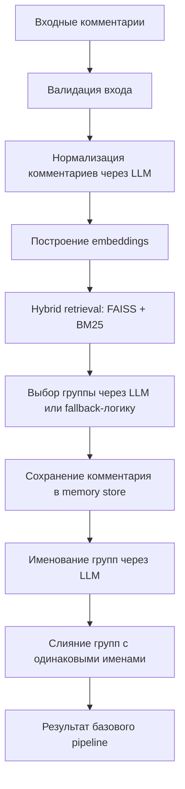
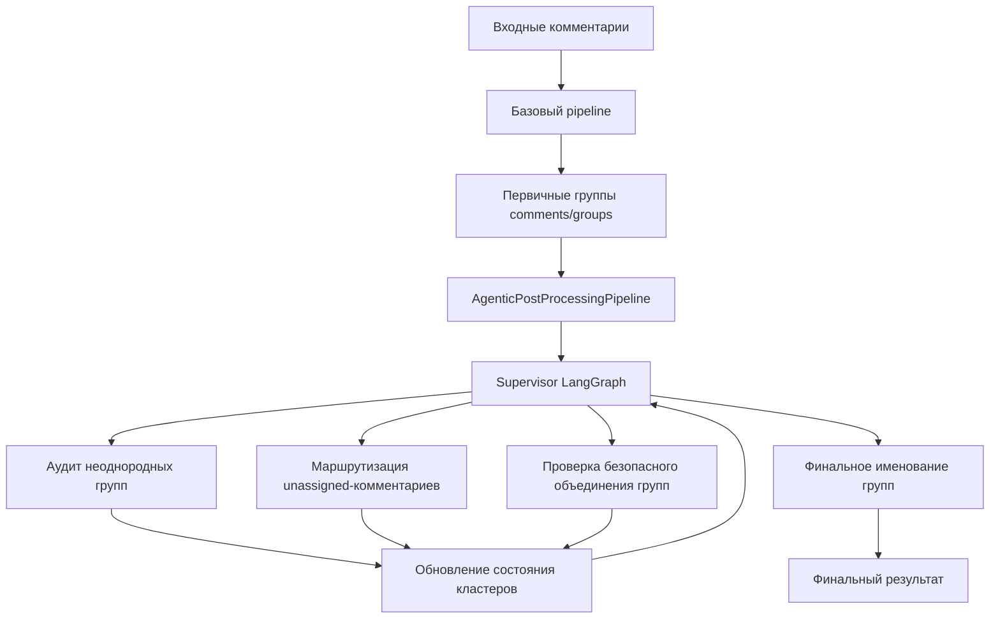

# clusteringtextdata

Библиотека для кластеризации текстовых комментариев через векторный поиск и LLM.

В проекте есть два публичных pipeline:

- `VectorLLMClusteringPipeline` — базовая кластеризация: нормализация комментариев, embedding, поиск похожих комментариев через FAISS/BM25, LLM-решение о группе, именование групп.
- `VectorLLMAgenticClusteringPipeline` — полный pipeline: базовая кластеризация плюс агентская LLM-постобработка через LangGraph.

Библиотека не создает LLM-клиент сама и не читает API-ключи. Вы передаете готовые LangChain-объекты `llm` и `embeddings` снаружи.

## Установка

Из корня проекта:

```bash
pip install -e .
```

или через `uv`:

```bash
uv pip install -e .
```

## Входные данные

Базовый вход — список словарей:

```python
comments = [
    {"comment_id": "1", "text": "Не могу подтвердить перевод"},
    {"comment_id": "2", "text": "Долго приходит код подтверждения"},
]
```

Обязательные поля:

- `text` — исходный текст комментария.
- `comment_id` — идентификатор комментария. Если поле пустое, pipeline подставит порядковый номер.

## Схема работы pipeline



Для `VectorLLMClusteringPipeline` выполнение заканчивается на этом этапе.



Для `VectorLLMAgenticClusteringPipeline` базовая кластеризация выступает первым этапом, после которого запускается агентская постобработка.

## Базовая кластеризация

```python
from clusteringtextdata import VectorLLMClusteringPipeline

pipeline = VectorLLMClusteringPipeline(
    llm=llm,
    embeddings=embeddings,
    retrieval_top_k=12,
    max_examples_per_candidate_group=3,
    primary_similarity_threshold=0.5,
)

result = pipeline.run(comments)
```

Асинхронный запуск:

```python
result = await pipeline.arun(comments)
```

Результат:

```python
{
    "comments": [
        {
            "comment_id": "1",
            "raw_text": "...",
            "normalized_text": "...",
            "embedding": [...],
            "group_id": "group_0001",
            "decision_type": "new_group",
            "decision_reason": "...",
        }
    ],
    "groups": [
        {"group_id": "group_0001", "group_name": "..."}
    ],
}
```

## Полный pipeline с агентской постобработкой

```python
from clusteringtextdata import VectorLLMAgenticClusteringPipeline

pipeline = VectorLLMAgenticClusteringPipeline(
    llm=llm,
    embeddings=embeddings,
    primary_kwargs={
        "retrieval_top_k": 12,
        "primary_similarity_threshold": 0.5,
    },
    agentic_kwargs={
        "max_rounds": 100,
        "candidate_cluster_limit": 40,
        "merge_groups_by_final_name": True,
    },
)

result = pipeline.run(comments)
```

Этот вариант сначала строит первичные группы, затем запускает supervisor-граф. Агентская постобработка может:

- проверять неоднородные группы;
- снимать неверные комментарии с группы;
- заново маршрутизировать комментарии без группы;
- проверять безопасное объединение групп;
- переименовывать финальные группы.

## Настройка prompt-ов

Prompt-ы вынесены в конфигурацию. Это позволяет менять поведение кластеризации без изменения кода pipeline.

### Базовые prompt-ы

```python
from clusteringtextdata import PrimaryPromptConfig, VectorLLMClusteringPipeline

prompts = PrimaryPromptConfig.default()
prompts.primary_decision_system = prompts.primary_decision_system + (
    "\nДополнительное правило: не объединяй комментарии про разные каналы обслуживания."
)

pipeline = VectorLLMClusteringPipeline(
    llm=llm,
    embeddings=embeddings,
    prompt_config=prompts,
)
```

Поля `PrimaryPromptConfig`:

- `normalization_system` — system prompt нормализации.
- `normalization_human` — human prompt нормализации. Должен содержать переменную `{text}`.
- `primary_decision_system` — system prompt выбора группы.
- `primary_decision_human` — human prompt выбора группы. Должен содержать `{raw_text}`, `{normalized_text}`, `{candidate_groups}`.
- `group_naming_system` — system prompt именования группы.
- `group_naming_human` — human prompt именования группы. Должен содержать `{group_examples}`.

### Prompt-ы полного pipeline

```python
from clusteringtextdata import (
    AgenticPromptConfig,
    ClusteringPromptConfig,
    PrimaryPromptConfig,
    VectorLLMAgenticClusteringPipeline,
)

prompt_config = ClusteringPromptConfig(
    primary=PrimaryPromptConfig.default(),
    agentic=AgenticPromptConfig(
        supervisor_system="Твой system prompt supervisor-а...",
        merge_groups_system="Твой system prompt проверки объединения...",
    ),
)

pipeline = VectorLLMAgenticClusteringPipeline(
    llm=llm,
    embeddings=embeddings,
    prompt_config=prompt_config,
)
```

Поля `AgenticPromptConfig` можно заполнять частично. Если поле равно `None`, используется дефолтный prompt из библиотеки.

Поля `AgenticPromptConfig`:

- `supervisor_system`, `supervisor_human` — выбор следующего агентского действия.
- `route_unassigned_system`, `route_unassigned_human` — маршрутизация комментариев без группы.
- `cluster_audit_system`, `cluster_audit_human` — аудит группы.
- `group_naming_system`, `group_naming_human` — финальное именование группы.
- `merge_groups_system`, `merge_groups_human` — проверка объединения двух групп.

## Параметры базового pipeline

- `retrieval_top_k` — сколько похожих комментариев доставать из hybrid retrieval.
- `max_examples_per_candidate_group` — максимум примеров из одной группы в prompt выбора группы.
- `min_meaningful_length` — минимальная длина осмысленного текста после нормализации.
- `primary_similarity_threshold` — порог fallback-решения для выбора существующей группы без LLM.
- `max_concurrent_llm_requests` — лимит параллельных LLM-запросов.
- `max_concurrent_embedding_requests` — лимит параллельных embedding-запросов.
- `prompt_config` — экземпляр `PrimaryPromptConfig`.

## Параметры агентской постобработки

- `text_fields` — порядок полей, из которых берется текст комментария.
- `comment_id_field` — поле идентификатора комментария.
- `group_id_field` — поле идентификатора группы.
- `group_name_field` — поле названия группы.
- `new_group_prefix` — префикс новых групп.
- `supervisor_group_limit` — максимум групп в snapshot supervisor-а.
- `supervisor_examples_per_group` — количество примеров на группу в snapshot.
- `supervisor_unassigned_limit` — максимум комментариев без группы в snapshot.
- `max_examples_per_candidate_group` — максимум примеров на группу-кандидат при маршрутизации.
- `route_batch_size` — сколько комментариев supervisor может отправить на маршрутизацию за шаг.
- `audit_comment_limit` — сколько комментариев группы передается на аудит.
- `merge_example_limit` — сколько примеров группы передается при проверке объединения.
- `max_concurrent_llm_requests` — лимит параллельных LLM-запросов.
- `candidate_cluster_limit` — максимум групп-кандидатов для маршрутизации.
- `max_rounds` — максимум циклов supervisor -> action.
- `max_no_change_rounds` — максимум подряд идущих шагов без изменений.
- `max_audit_passes_per_group` — максимум аудитов одной группы.
- `merge_groups_by_final_name` — включить проверку объединения групп с одинаковыми финальными именами.
- `prompt_config` — экземпляр `AgenticPromptConfig`.

## Структура результата

`comments` содержит исходный текст, нормализованный текст, embedding, группу и причину решения.

`groups` содержит идентификаторы групп и финальные названия.

В полном pipeline дополнительно может быть служебная информация постобработки, которую формирует `AgenticPostProcessingPipeline`.

## Ограничения

- Библиотека ожидает совместимые LangChain-модели `BaseChatModel` и `Embeddings`.
- Код не хранит ключи и не создает клиентов провайдеров.
- Для больших датасетов важно настроить лимиты параллелизма и размеры prompt-ов.
